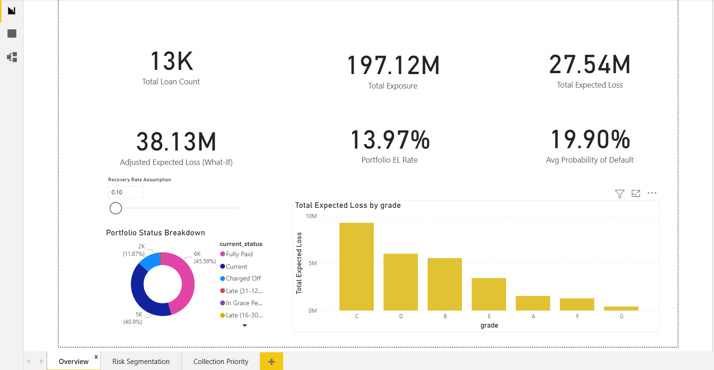
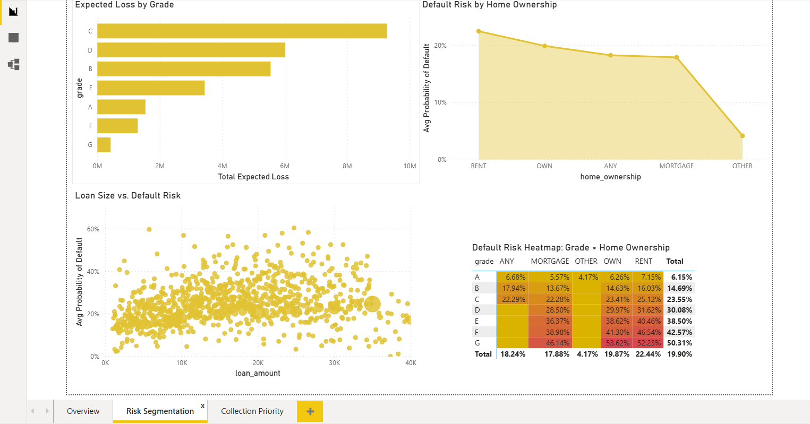
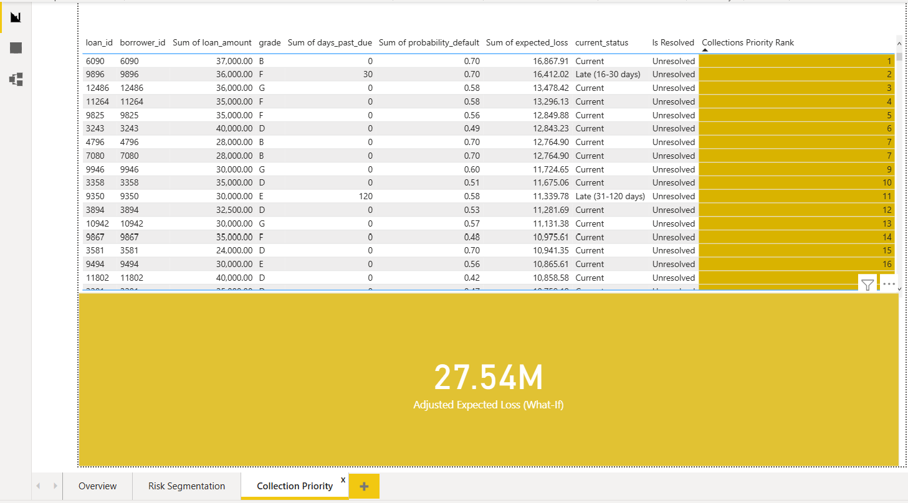
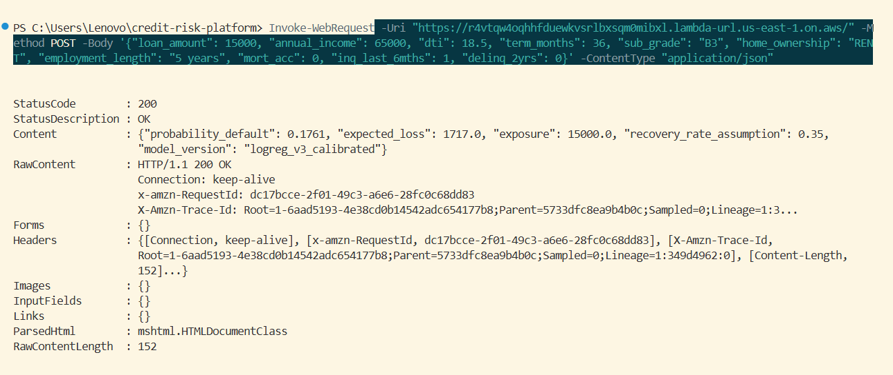
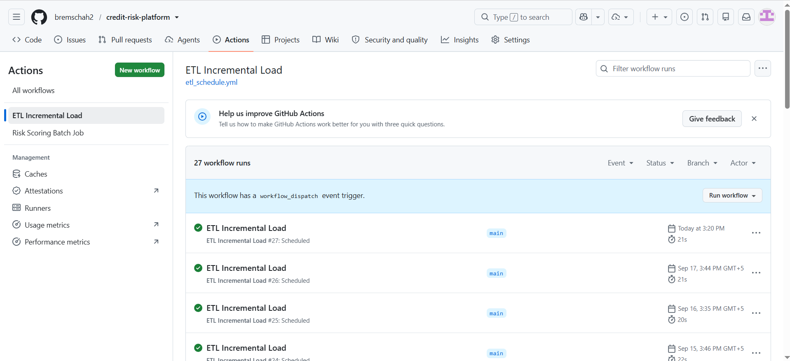
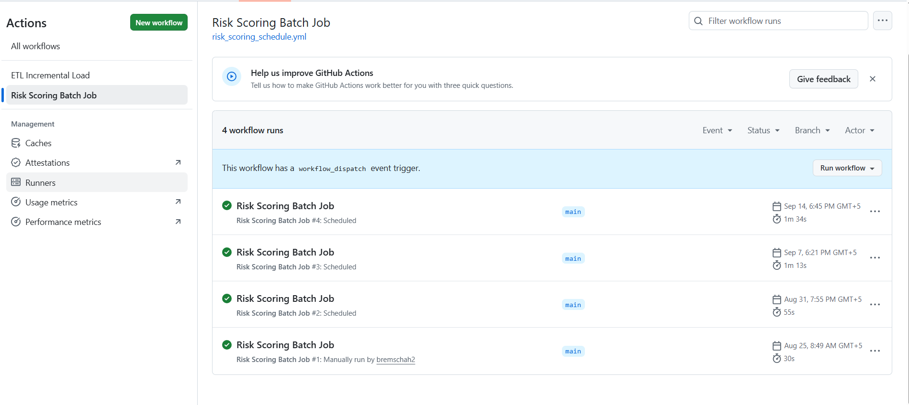
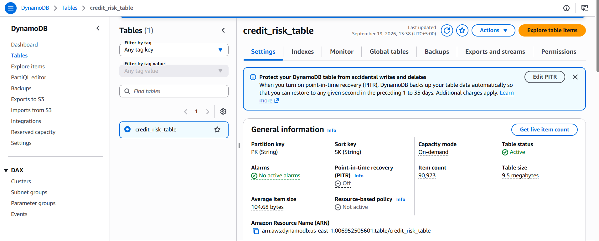
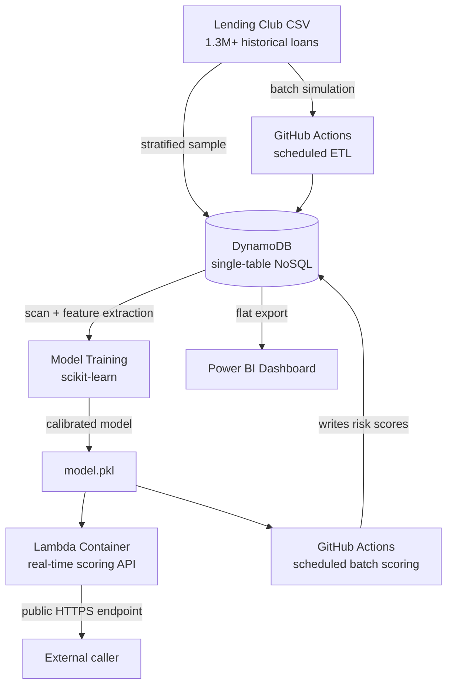

# Credit Risk & Collections Prioritization Platform

A cloud-hosted platform that predicts loan default risk and translates it into dollar-value expected loss, so a lender could prioritize collections effort where it actually matters — built end-to-end across cloud infrastructure, data engineering, machine learning, and business intelligence.

**Live demo:** [Real-time scoring API](https://r4vtqw4oqhhfduewkvsrlbxsqm0mibxl.lambda-url.us-east-1.on.aws/) (POST a loan's details, get back a risk score and expected loss — see [usage example](#try-it-yourself) below)

---

## Results

| Metric | Value |
|---|---|
| Portfolio scored | 12,996 loans |
| Total exposure | $197,120,575 |
| Total expected loss | $27,540,353 |
| Portfolio expected-loss rate | 13.97% |
| Model ROC-AUC (calibrated) | 0.6964 |
| Model Brier score (post-calibration) | 0.1482 (down from 0.2235 uncalibrated — a 34% improvement) |

The model's raw probabilities were found to be overconfident by up to **34 percentage points** at the high end before calibration — this was diagnosed and corrected using isotonic regression.

---

## Screenshots

### Dashboard

**Portfolio Overview** — headline KPIs, expected loss by grade, portfolio status breakdown, and an interactive what-if recovery-rate parameter.


**Risk Segmentation** — expected loss by purpose/grade, default risk by home ownership, individual-loan scatter analysis, and a grade x home-ownership risk heatmap.


**Collections Priority List** — unresolved loans only, ranked by expected loss, the actual worklist a collections team would use.


### Live API

A real request/response against the deployed, publicly reachable scoring endpoint.


### Automation

Both scheduled pipelines have been running unattended, on schedule, since deployment.

**ETL pipeline** — 27+ scheduled runs, incrementally loading new loan batches.


**Risk scoring batch job** — scheduled weekly, keeps every loan's risk score current.


### Infrastructure

The live DynamoDB table backing the whole system — Active, on-demand capacity, 90,973 items.


---

## Architecture



**Why this shape:** DynamoDB was chosen for its genuinely-free-forever guarantee after two relational database options (Aurora DSQL, Aurora PostgreSQL Serverless) were blocked by AWS account-level restrictions — documented in [ADR-001](docs/pm/adr/001-database-selection.md). This single decision shaped everything downstream: a NoSQL single-table schema instead of normalized relational tables ([ADR-002](docs/pm/adr/002-no-foreign-keys.md)), and a scheduled-export pattern instead of a live BI connection ([ADR-003](docs/pm/adr/003-export-vs-live-bi-connection.md)).

---

## What's in this repo

| Folder | Contents |
|---|---|
| `db/` | DynamoDB schema, initial data load, table reload/migration scripts |
| `etl/` | Incremental ETL pipeline, batch generation, GitHub Actions workflow |
| `ml/` | Feature extraction, model training, calibration, expected-loss scoring |
| `api/` | Lambda container (Dockerfile, handler) for the real-time scoring API |
| `dashboard/` | Power BI export script and `.pbix` file |
| `docs/pm/` | Project charter, RAID log, 5 Architecture Decision Records |
| `.github/workflows/` | Scheduled automation: ETL pipeline, batch risk scoring |

---

## Try it yourself

```bash
curl -X POST "https://r4vtqw4oqhhfduewkvsrlbxsqm0mibxl.lambda-url.us-east-1.on.aws/" \
  -H "Content-Type: application/json" \
  -d '{
    "loan_amount": 15000,
    "annual_income": 65000,
    "dti": 18.5,
    "term_months": 36,
    "sub_grade": "B3",
    "home_ownership": "RENT",
    "employment_length": "5 years",
    "mort_acc": 0,
    "inq_last_6mths": 1,
    "delinq_2yrs": 0
  }'
```

Returns:
```json
{
  "probability_default": 0.1761,
  "expected_loss": 1717.0,
  "exposure": 15000.0,
  "recovery_rate_assumption": 0.35,
  "model_version": "logreg_v3_calibrated"
}
```

*Note: this endpoint uses no authentication, a deliberate simplification for portfolio demo purposes.*

---

## Tech stack

**Cloud & Infrastructure:** AWS (DynamoDB, Lambda, IAM, ECR), Docker, GitHub Actions
**Data Engineering:** Python, boto3, pandas, scheduled ETL, single-table NoSQL design
**Data Science:** scikit-learn (logistic regression, calibration), XGBoost, permutation importance, feature engineering
**Analytics/BI:** Power BI, DAX, What-If parameters
**Project Management:** ADRs, RAID log, project charter

---

## Model scope and limitations — stated honestly

This model is suited for **relative risk ranking and collections prioritization**, not automated credit approval or denial decisions. Its ROC-AUC (0.6964) is below what production bureau-based credit scorecards typically achieve, primarily due to the absence of a credit score field in this public dataset. Full reasoning in [ADR-004](docs/pm/adr/004-recovery-rate-and-model-scope.md).

---

## Data source

[Lending Club Loan Data](https://www.kaggle.com/datasets) (public dataset, Kaggle) — anonymized historical loan records, ~2.26M rows, 145 columns.

---

## Author

Built by Shah Brahim as a cross-track portfolio project spanning Data Analyst, Data Scientist, Data Engineer, and IT Project Management competencies on a single coherent system. See `docs/pm/charter.md` for the full project scope and objectives.